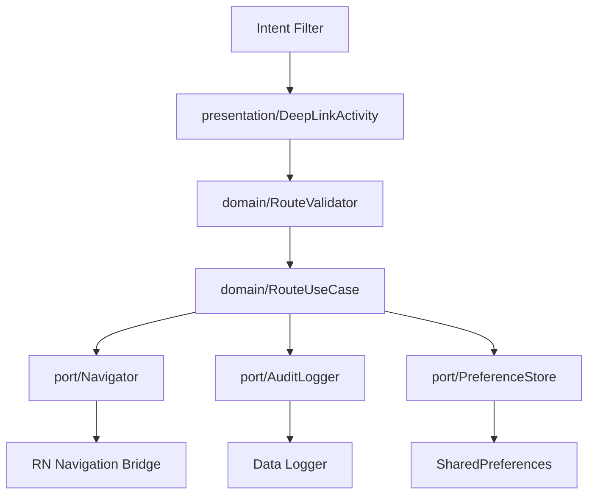
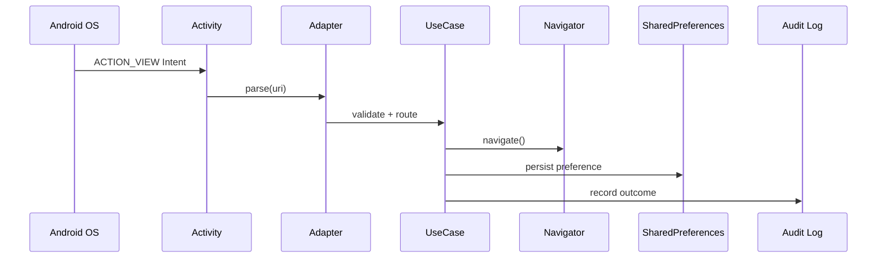
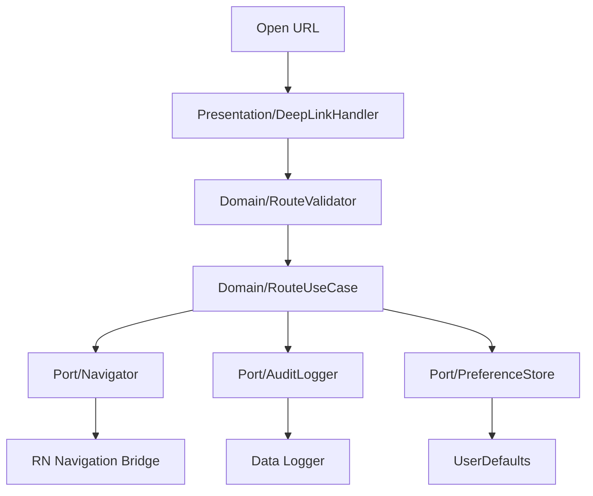
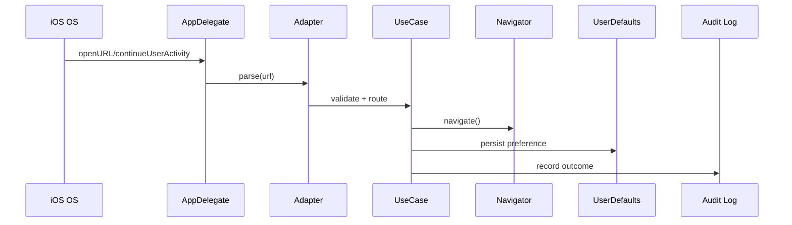

# Router + Deep Link Technical Document

## 1. Introduction and Goals
Build a small React Native app with an anchored Agent Flyout that can navigate and control UI through validated, auditable commands. The system must run on iOS and Android with native filesystem export and persistent preferences.

Goals:
- Consistent behavior on iOS/Android
- Command allowlist + validation + confirmation rules
- Auditable activity log
- Native audit export without RN/Expo filesystem libraries
- Persistent preferences

## 2. Dependencies
- React Native (UI + runtime)
- TypeScript (domain contracts)
- Native modules (Android/iOS) for filesystem and preferences

## 3. Solution Strategy
- Keep all agent actions as structured commands.
- Route through a Command Router (allowlist + validation).
- Require confirmation for sensitive commands.
- Persist preferences and export logs through native modules.

## 4. System and Architecture Design
Clean Architecture layers:
- **Presentation**: RN screens + anchored Agent Flyout.
- **Domain**: Command router, validation, confirmation rules, activity logging.
- **Data**: Native module bridge and persistence/export.

### Android Host
- `MainActivity` is a `ReactActivity` and loads RN `RouterApp`.
- `MainApplication` registers native modules.
- Deep links via intent filters are routed to RN through `Linking`.

### iOS Host
- SwiftUI shell embeds `RNHostView` (RCTRootView).
- RN bundle loaded from Metro.
- URL scheme `routerapp://` is registered and handled in SwiftUI.

## 5. Specifications and Implementation Details
**Required screens**
- Home
- Explore (filter + sort)
- Profile (persistent toggle + activity log)

**Agent Flyout**
- Anchored panel with prompt input
- Suggested actions
- “Proposed Action” card + confirmation
- Activity log visible in Profile

**Minimum command set**
- `navigate(screen)`
- `openFlyout()` / `closeFlyout()`
- `applyExploreFilter(filter, sort?)`
- `setPreference(key, value)` (confirmation required)
- `showAlert(title, message)`
- `exportAuditLog(log)` (confirmation required)

**Native module**
- Writes audit log JSON to Documents directory.
- No RN/Expo filesystem libraries.

## 6. Business Logic
- Commands go through `CommandRouter` only.
- Unknown commands are rejected with reason.
- `setPreference` and `exportAuditLog` require confirmation.
- Activity log records accepted/rejected actions.

## 7. Interfaces
### 7.a Internal
- `CommandRouter.dispatch(command)`
- `CommandRouter.confirm(command)`
- `NativeModules.AuditLogExporter.exportLog(logText)`
- `NativeModules.PreferenceStore.getBool(key)`
- `NativeModules.PreferenceStore.setBool(key, value)`

### 7.b External (GROQ)
- Server-side call to `/v1/chat/completions` (model output treated as untrusted).

## 8. Platform-Specific Implementation
### 8a Android
- `presentation/MainActivity.kt` (ReactActivity host)
- `presentation/MainApplication.kt` (ReactNativeHost)
- `nativebridge/AuditLogExporterModule.kt`
- `nativebridge/PreferenceStoreModule.kt`

### 8b iOS
- `RouterAppApp/ContentView.swift` embeds `RNHostView`
- `RouterCore/Presentation/RNHostView.swift` (RCTRootView)
- `RouterCore/Data/AuditLogExporter.swift`
- `RouterCore/Data/PreferenceStoreModule.swift`

## 9. Folder Structure
```
/
  agent/CONTEXT.md
  artifacts/
    decisions.md
    architecture.md
  code/
    app/                # React Native app
    android/            # Android host + native modules
    ios/                # iOS host + native modules
    web/                # Deep link launcher
```

## 10. Run and Install
### 10.a Run (Local)
- **React Native**:
  - `cd code/app`
  - `npm install`
  - `npm start`
- **Android**:
  - `cd code/android`
  - `./gradlew :app:assembleDebug`
  - Run from Android Studio
- **iOS**:
  - Open `code/ios/RouterAppApp/RouterAppApp.xcodeproj` in Xcode and Run
- **Web**:
  - `cd code/web`
  - `npm install`
  - `npm run dev`

### 10.b Environment
- Android: `export GROQ_API_KEY="your_key_here"`
- iOS: Xcode Scheme → Run → Environment Variables → `GROQ_API_KEY`
- Web: `cp .env.example .env`

## 11. Testing
- Android: `RouteValidatorTest`
- iOS: `RouteValidatorTests`
- Functional: deep link into Home/Explore/Profile via RN `Linking`

## 12. Decisions (Summary)
See `artifacts/decisions.md`.

## 13. Risks
- RN host wiring is minimal (no navigation library).
- Deep link parsing is basic (host-based).

## 14. Business Rules
- Only allowlisted commands execute.
- Confirmation required for state changes and export.
- All outcomes are logged.
# Router + Deep Link Technical Document

## 1. Introduction and Goals
We need a clean, reliable, and cross-platform deep link routing system for a React Native app that can safely map URLs/Intents to in-app navigation and state changes. The solution should use Clean Architecture, be easy to extend, and degrade gracefully instead of crashing when inputs are invalid or partial.

Goals:
- Consistent behavior across iOS and Android
- Validated routing with explicit allowlists and value constraints
- Centralized navigation policy with auditable outcomes
- Graceful failures (reject + inform + log)
- Clear separation of UI, domain, and data layers

## 2. Dependencies
- React Native (app shell, UI)
- TypeScript (shared contracts and validation)
- Platform native entry points (iOS AppDelegate/SceneDelegate, Android Intent)
- Persistent storage (Android SharedPreferences, iOS UserDefaults)

## 3. Solution Strategy
- Define a shared route contract in the domain layer.
- Parse platform deep link inputs into a RouteRequest.
- Validate and normalize inputs in a Router/UseCase.
- Delegate navigation through a Navigator adapter.
- Record decisions and outcomes into a lightweight audit log.

### 3.a Mobile Responsibilities and Flow (Consolidated)
1. Receive deep link (URL/Intent).
2. Parse into RouteRequest.
3. Validate route and params.
4. Map to navigation + state.
5. Persist state changes if needed.
6. Log outcome.
7. Notify user if rejected (non-crashing failure).

## 4. System and Architecture Design
Clean Architecture layers:
- **Presentation**: RN screens, navigation container, UI components.
- **Domain**: Route contracts, validation rules, use cases.
- **Data**: Storage adapters, audit log repository, deep link parsers.

### 4.a iOS
- Entry: `application(_:open:options:)` and `application(_:continue:restorationHandler:)`
- Presentation: `DeepLinkHandler` receives URL and delegates to domain use case
- Domain: `RouteUseCase` + `RouteValidator` + models
- Data: `UserDefaultsStore` and `AuditLogger` implementations
- Navigation: RN bridge to React Navigation (via Navigator port)

### 4.b Android
- Entry: `Intent.ACTION_VIEW` with URI
- Presentation: `DeepLinkActivity` receives URI and delegates to domain use case
- Domain: `RouteUseCase` + `RouteValidator` + models
- Data: `SharedPreferences` and `AuditLogger` implementations
- Navigation: RN bridge to React Navigation (via Navigator port)

## 5. Specifications and Implementation Details
- **Route Contract**: `route`, `params`, `source`, `timestamp`
- **Allowed Routes**:
  - `home`
  - `explore`
  - `profile`
  - `explore?filter=<value>&sort=<value>`
  - `profile?toggle=<key>&value=<bool>`
- **Validation Rules**:
  - Unknown routes are rejected with reason.
  - Missing required params are rejected with reason.
  - Invalid values are rejected with reason.
- **Graceful Degradation**:
  - Invalid deep links do not crash.
  - UI displays a non-blocking toast or alert.
  - Log entry created for audit.
- **Agent Flyout (implemented)**:
  - Anchored panel with suggested actions and confirmation flow.
  - Activity log surfaced in Profile.
  - Command allowlist + validation + confirmation rules in domain layer.
- **Native export (implemented)**:
  - Android: writes `agent_audit_log.json` to Documents/files dir.
  - iOS: writes `agent_audit_log.json` to Documents dir.
- **RN bridge (implemented in code)**:
  - JS uses `NativeModules.AuditLogExporter` and `NativeModules.PreferenceStore`.
  - Native module classes exist in Android/iOS projects for wiring.
- **Deep links (RN integration)**:
  - React Native listens to `Linking` events and routes to Home/Explore/Profile.
- **RN host (native)**:
  - Android `MainActivity` extends `ReactActivity` and loads `RouterApp`.
  - iOS SwiftUI embeds `RNHostView` for `RouterApp`.
- **Preference persistence (implemented)**:
  - Android: SharedPreferences via native module.
  - iOS: UserDefaults via native module.

## 6. Business Logic
- All routing decisions go through `RouteUseCase` (domain).
- Presentation layer parses URL/URI and passes a `RouteRequest` into the use case.
- Navigation is requested through the `Navigator` port, not directly from entry points.
- Preferences are persisted through the `PreferenceStore` port (UserDefaults/SharedPreferences).
- The UI renders state only and never performs validation/parsing.

## 7. Internal Interfaces (Routing Contracts)

### 7.a List
1. `handleDeepLink(input)`
2. `parseDeepLink(input)`
3. `validateRoute(routeRequest)`
4. `routeToDestination(routeRequest)`
5. `persistPreference(key, value)`
6. `logDecision(routeRequest, outcome)`
7. `openFlyout()` / `closeFlyout()`

### 7.b Description and Payload
1. `handleDeepLink(input)`
   - Payload: `{ url?: string, intent?: string }`
   - Output: `RouteOutcome`
2. `parseDeepLink(input)`
   - Payload: `{ url?: string, intent?: string }`
   - Output: `RouteRequest`
3. `validateRoute(routeRequest)`
   - Payload: `{ route: string, params: Record<string, string> }`
   - Output: `{ valid: boolean, reason?: string }`
4. `routeToDestination(routeRequest)`
   - Payload: `{ route: string, params: Record<string, string> }`
   - Output: `{ navigated: boolean }`
5. `persistPreference(key, value)`
   - Payload: `{ key: string, value: boolean }`
   - Output: `{ stored: boolean }`
6. `logDecision(routeRequest, outcome)`
   - Payload: `{ routeRequest, outcome, timestamp }`
   - Output: `{ logged: boolean }`
7. `openFlyout()` / `closeFlyout()`
   - Payload: `{}`
   - Output: `{ opened: boolean }`

## 7.c External API (GROQ Agent)
The app integrates with GROQ for agent responses. This is a server-side API call to avoid exposing API keys on device.

### Endpoints
- `POST /v1/chat/completions`

### Request (example)
```json
{
  "model": "llama-3.1-70b-versatile",
  "messages": [
    { "role": "system", "content": "You are a routing assistant for the app." },
    { "role": "user", "content": "Open Explore with filter active." }
  ],
  "temperature": 0.2
}
```

### Response (example)
```json
{
  "id": "chatcmpl-xxx",
  "choices": [
    {
      "index": 0,
      "message": {
        "role": "assistant",
        "content": "{\"command\":\"navigate\",\"screen\":\"explore\",\"filter\":\"active\"}"
      }
    }
  ]
}
```

### Notes
- The app only accepts commands that pass validation and confirmation rules.
- All model outputs are treated as untrusted inputs.

## 8. Platform Specific Implementation Details

### 8a Android
#### Android-Specific Implementation
- `presentation/deeplink/DeepLinkActivity` handles `ACTION_VIEW` and extracts URI.
- `domain/validation/RouteValidator` validates `RouteRequest`.
- `domain/usecase/RouteUseCase` validates, persists, navigates, and logs.
- `domain/port/*` defines ports for navigation, preferences, and logging.
- Data adapters implement ports (SharedPreferences + logger).
- Native modules:
  - `nativebridge/AuditLogExporterModule` writes audit log to Documents/files dir.
  - `nativebridge/PreferenceStoreModule` persists preferences in SharedPreferences.

#### Architecture Diagrams + Module View + Flow Charts + Sequence Diagrams + Persistence Layer




#### Data Models and Relationships
- `RouteRequest`: `route`, `params`, `source`, `timestamp`
- `RouteOutcome`: `status`, `reason`, `navigated`, `logged`
- `PreferenceState`: `key`, `value`, `updatedAt`
- Relationship: `RouteOutcome` references `RouteRequest` (one-to-one).

#### Code Snippets (High-Level)
```kotlin
data class RouteRequest(
  val route: String,
  val params: Map<String, String>,
  val source: String,
  val timestamp: Long
)

class RouteUseCase(
  private val validator: RouteValidator,
  private val navigator: Navigator,
  private val prefs: PreferenceStore,
  private val logger: AuditLogger
) {
  fun handle(request: RouteRequest): RouteOutcome {
    val result = validator.validate(request)
    if (!result.valid) return logger.reject(request, result.reason ?: "invalid")
    if (request.route == "profile") {
      val key = request.params["toggle"]
      val value = request.params["value"]?.toBoolean() ?: false
      if (key != null) prefs.set(key, value)
    }
    navigator.navigate(request.route, request.params)
    return logger.accept(request)
  }
}
```

### 8b iOS
#### iOS-Specific Implementation
- `Presentation/DeepLink/DeepLinkHandler` receives URL and builds `RouteRequest`.
- `Domain/Validation/RouteValidator` validates `RouteRequest`.
- `Domain/UseCase/RouteUseCase` validates, persists, navigates, and logs.
- `Domain/Port/*` defines ports for navigation, preferences, and logging.
- Data adapters implement ports (UserDefaults + logger).
- Native modules:
  - `Data/AuditLogExporter` writes audit log to Documents dir.
  - `Data/PreferenceStoreModule` persists preferences in UserDefaults.

#### Architecture Diagrams + Module View + Flow Charts + Sequence Diagrams + Persistence Layer




#### Data Models and Relationships
- `RouteRequest`: `route`, `params`, `source`, `timestamp`
- `RouteOutcome`: `status`, `reason`, `navigated`, `logged`
- `PreferenceState`: `key`, `value`, `updatedAt`
- Relationship: `RouteOutcome` references `RouteRequest` (one-to-one).

#### Code Snippets (High-Level)
```swift
struct RouteRequest {
  let route: String
  let params: [String: String]
  let source: String
  let timestamp: TimeInterval
}

final class RouteUseCase {
  let validator: RouteValidator
  let navigator: Navigator
  let prefs: PreferenceStore
  let logger: AuditLogger

  func handle(_ request: RouteRequest) -> RouteOutcome {
    let result = validator.validate(request)
    if !result.valid { return logger.reject(request, reason: result.reason ?? "invalid") }
    if request.route == "profile" {
      let key = request.params["toggle"] ?? ""
      let value = (request.params["value"] as NSString?)?.boolValue ?? false
      if !key.isEmpty { prefs.set(key, value) }
    }
    navigator.navigate(route: request.route, params: request.params)
    return logger.accept(request)
  }
}
```

## 9. Folder Structure

### Root
```
/
  agent/
    CONTEXT.md
  artifacts/
    decisions.md
    architecture.md
  app/
  android/
  ios/
  app/
    App.tsx
    src/
      presentation/
      domain/
      data/
    package.json
```

### 9.a Android
```
android/
  app/src/main/java/.../
    presentation/
      deeplink/
    domain/
      model/
      validation/
      usecase/
      port/
    data/
      storage/
      logging/
```

### 9.b iOS
```
ios/
  RouterAppApp/
    RouterAppApp.xcodeproj
    RouterAppApp/
      Assets.xcassets/
      ContentView.swift
      Info.plist
      RouterAppAppApp.swift
    RouterCore/
      Presentation/
      Domain/
      Data/
```

## 10. Testing
- Unit tests for route validation (invalid routes, missing params).
- Integration test for deep link -> navigation.
- Storage tests for preference persistence.
- Error path test ensuring graceful rejection with log entry.

## 10.d README Requirements (PDF)
The following sections are required and now documented in `code/README.md`:
- Setup
- Architecture (TL;DR)
- Key decisions
- AI disclosure
- Demo script
- Next steps
- Submission checklist
- One meaningful test description

## 10.a Run (Local)
- **Android**: Open `code/android` in Android Studio, run the `Run Debug` config.
- **Gradle**: `./gradlew :app:deployDebug` (device/emulator required).
- **iOS**: Open `code/ios/RouterAppApp/RouterAppApp.xcodeproj` in Xcode and run.
- **React Native app**:
  - `cd code/app`
  - `npm install`
  - `npm start`
- **Web**:
  - `cd code/web`
  - `npm install`
  - `npm run dev`

## 10.b Install (Local)
- **Android**:
  - `cd code/android`
  - `./gradlew :app:assembleDebug`
  - `./gradlew :app:installDebug`
- **Android env**:
  - `export GROQ_API_KEY="your_key_here"` (shell session used for build/run)
- **iOS**:
  - Open `code/ios/RouterAppApp/RouterAppApp.xcodeproj` in Xcode
  - Select a simulator or device and press Run
- **iOS env**:
  - In Xcode: Product → Scheme → Edit Scheme → Run → Arguments → Environment Variables
  - Add `GROQ_API_KEY=your_key_here`
- **Web**:
  - `cd code/web`
  - `cp .env.example .env`
  - `npm install`
  - `npm run dev`

## 10.c Decision Tracking (Latest)
| Decision | Chosen | Alternatives | Why |
|---|---|---|---|
| Audit log export | Native filesystem module | RN/Expo FS libs | Requirement forbids RN FS libs |
| Preference persistence | SharedPreferences/UserDefaults | JS-only state | Must be persistent |
| Confirmation policy | Confirm `setPreference` + `exportAuditLog` | Confirm all commands | Keep UX light while protecting sensitive actions |
| Agent responses | Contextual answers for screens/filters | Generic replies | Required to be app-grounded |

## 11. Risks
- Incomplete allowlist coverage causing unexpected rejections.
- Navigation race conditions if link arrives during app startup.
- URI parsing differences between iOS and Android.

## 12. Open Questions
- Should deferred deep links be supported in phase 1?
- Do we need analytics beyond the audit log?
- Should a web-based deep link generator be included?

## 13. Architectural Decision Records
- **ADR-001**: Clean Architecture with separated domain and data layers.
- **ADR-002**: Route allowlist with explicit parameter validation.
- **ADR-003**: Use platform-specific adapters at entry points.
- **ADR-004**: Shared preferences/UserDefaults for preference state.
- **ADR-005**: Native filesystem export for audit log (no RN FS libs).

## 14. Business Rule Decisions
- All unknown routes are rejected and logged.
- Preference changes only happen through validated routes.
- Audit log export requires explicit confirmation.
- The system must inform the user on rejection (toast/alert).
- Graceful degradation is preferred over crashes for invalid inputs.
