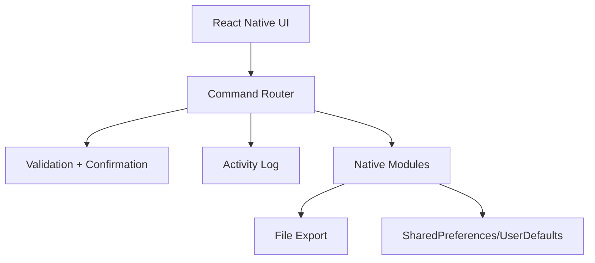

# Architecture (TL;DR)

- React Native provides the UI (Home/Explore/Profile) and the anchored Agent Flyout.
- Domain layer enforces command allowlist, validation, confirmation rules, and logging.
- Native modules implement audit log export and preference persistence on iOS/Android.

